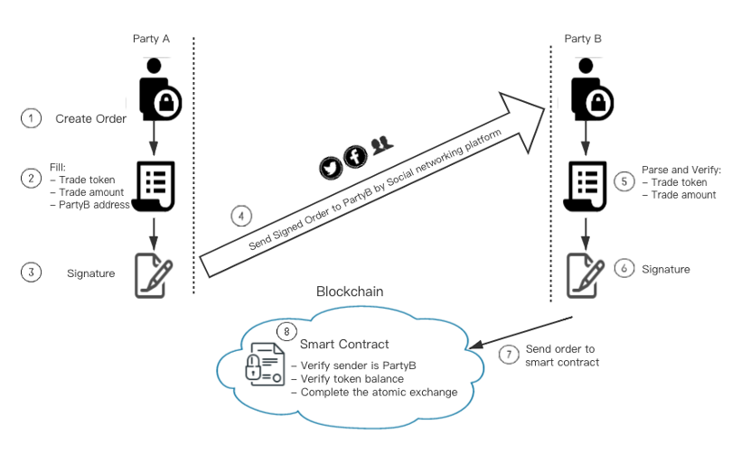

# Peer To Peer Private Exchange Platform
# Working Principles

# 1. Overview

**Pain points for cryptocurrency traders:**

<u>DEX and CEX: price slippage and inability to set transaction participants</u> – When users are trading on ordinary centralized/decentralized exchanges, it is impossible for traders to specify who they want to trade with. It is also impossible to guarantee that a transaction will occur at their desired price target. With large one time transactions in particular, price slippage is a major issue, and even the largest of exchanges don’t have the required liquidity to prevent serious slippage for large single transactions. 

<u>HTLC based cross-chain trades: trust burden and delays</u> – Ethereum HTLC transactions require that both parties in the transaction trust the transactions contracts. While the burden of trust for cross-chain HTLC transactions is even greater as each pair of cross-chain contracts supports transactions only for a single pair of chains. This means that users must trust each pair of cross-chain contracts for each pair of chains. As there is a possibility for smart contract owners to behave maliciously, this means users must place a great deal of trust in all these contracts. Moreover if a party wants to cancel or withdraw funds during HTLC contract transactions, there may be significant delays.

Our peer to peer private exchange platform (referred to as P2PE going forward), solves the above-mentioned pain points securely and effectively. Building on top of Wanchain’s cross-chain functionality, P2PE is able to safely and reliably meet the needs of multi-chain cryptocurrency traders. 

**P2PE Features:**

    1) 0 transaction fee for all orders.

    2) Ability determine the exact price and amount of currency for trade execution.

    3) All current WRC20 tokens can be traded supports the adding of new WRC20 tokens.

    4) Dual security guarantee based on both HTLC (Hash Time Locking Contract) andToken Approve.

    5) The order can be cancelled at any time before it is finalized on chain. Afterthe cancellation, the order is no longer available and there is no delay fortoken withdrawal.

    6) Order transaction information is not visible through the UI, it is onlyvisible through on-chain data.

    7) Doesn’t require sending of tokens to an online wallet of contract addressprior to transaction. Transactions can be executed directly from user’s wallet(with Ledger hardware wallet support).

    8) Multi-chain and multi-currency transactions can be supported throughWanchain’s cross-chain tech.

# 2. Smart contracts

P2PE guarantees the security of transactions through smart contracts, and directly reuses the secure, mature and verified contract codes of WANDEX, primarily involving 2 contracts: Proxy and Exchange.

The Exchange contract verifies the user input information and the signature of the information. After verifying the user's token balance, the Proxy contract is called to complete the atomic transfer of user assets according to the user’s input information.

The Proxy contract can only be called by the Exchange contract to transfer token assets. Once the ownership rights of the Proxy contract are revoked, no one, even the contract creator, is able to alter the contract so the Proxy can safely and verifiably handle user assets. This completely eliminates the possibility of malicious behavior on behalf of the contract creator.

Users do not need to deposit their tokens any contract address, they need only do the Approve operation with the Proxy contract before the transaction so that it has the ability to operate with the user’s tokens. After the transaction is completed, the Approve operation can be revoked to further ensure the safety of funds.

The smart contract code and front-end code are completely open source and open to public review:

[Smart contracts](https://github.com/wandevs/wandex-smart-contract/tree/v1.1)

[front-end](https://github.com/wandevs/p2pe-web)

# 3. Secure signature

Before sending order information to the smart contract, the user users their private key to sign the information with a secure encryption algorithm to ensure information cannot be tampered with and ensure the security of the transaction.
 
The order information to be signed includes:

| id | Item | Explanation |
|----|----|----|
|1|trader|Transaction initiator’s address – Party A|
|2|relayer|Party B’s address|
|3|data|Transaction timeout limit|
|4|baseTokenAmount|Token A amount|
|5|baseTokenAddress|Token A smart contract address |
|6|quoteTokenAmount|Token B amount|
|7|quoteTokenAddress|Token B smart contract address|

By hashing and signing the above information, key information related to the transaction is securely locked and can no longer be altered. Party A may send his hashed and signed information to Party B  with assurance that it cannot be changed in any way. 

The smart contract will verify the validity of this information and signature to ensure the security of the transaction.

# 4. Work flow

In a complete transaction process, two users, Party A and Party B are involved. The transaction process to complete a token exchange between Party A and Party B is as shown below:

    1) Party A and Party B negotiate the transaction terms (exchange amount of each token).

    2) Party A fills in the token type, token amount, and Party B’s address information (ensuring that after filling that this order can only be filled by B), timeout time (order is invalid after timeout time).

    3) After the above information is filled in, Party A signs all the information with their private key ensuring that no one can tamper with it. Then Party A need perform the Approve operation for the Proxy contract to authorize it to use Party A’s asset’s for the transaction.

    4) Party A sends the signed order data to Party B through off-chain means (email, messaging software, etc.).

    5) Party B pastes the order data sent from Party A in the appropriate field in the P2PE interface in order to verify the data. Party A’s original input data will be displayed, and Party B may check the token type and amount to confirm.

    6) After Party B verifies that Party A’s data is correct, Party B uses the data to generate the corresponding order and signs it. Then Party B needs to perform the Approve operation for the Proxy smart contract on chain in order to authorize it to transact with Party B’s tokens.  

    7) Party B submits the order and calls the smart contract interface on chain.

    8) The smart contract verifies the order information of Party A and Party B, verifies the legitimacy of the signature, and verifies that the token balances are sufficient to complete the transaction. After completing all the verification work, an atomic transaction initiates to complete the asset transfer between Party A and Party B.

# 5. Conclusion

P2PE is a well-designed decentralized application that can safely and reasonably meet user transaction needs.