# 点对点隐私交易平台 - 用户手册

# 1. 概述

点对点隐私交易平台（下文简称P2PE）是一款完全去中心化的交易DApp。

P2PE具备如下优势与特点：

1）	大额订单交易0手续费；

2）	自由限定交易价格和数量；

3）	支持任意自定义的WRC20标准token交易；

4）	基于HTLC（哈希时间锁定合约）和Token Approve开关双重安全保障；

5）	订单未上链前可随时取消，取消后订单不再可用，无需长时间等待；

6）	订单交易信息不公开，仅在链数据上可见；

7）	无需充值，不需要将token充到任何在线钱包或合约地址中，可在ledger中直接操作；

8）	通过跨链可支持多链多币种交易。

# 2. 应用场景

Lucy想要用0.0248 BTC的单价购买1,000个ETH，计划总花费24.8个BTC。

这个操作如果在交易所中完成，需要耗费大量的时间，并且最终平均价格和成本不可控。

因此Lucy在社交网络上发帖：《单价0.0248 BTC求购1,000个ETH》

Tom看到了Lucy的帖子，想要与她完成交易，于是他们双方沟通完毕后，按照如下方法进行操作，在很短的时间内，就安全高效的通过wanchain的跨链机制和P2PE产品完成了本次交易。

# 3. 操作说明

**步骤1**：Lucy和Tom同时到wanchain官网下载桌面版Wan Wallet软件。下载地址为：[https://wanchain.org/getstarted](https://wanchain.org/getstarted)

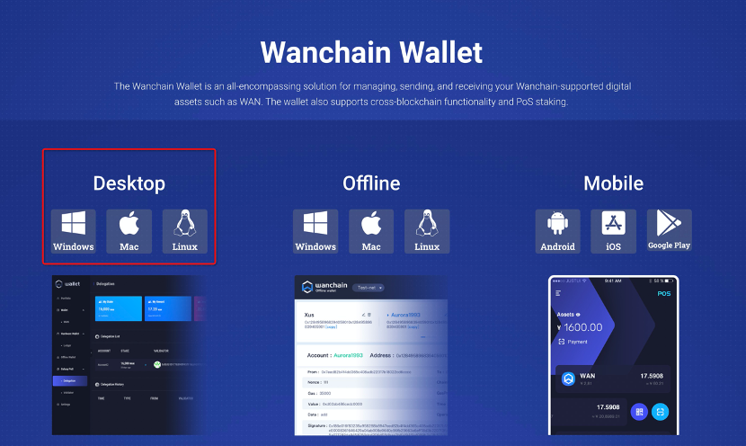

**步骤2**：Lucy和Tom在轻钱包中分别创建WAN地址、ETH地址和BTC地址。
 
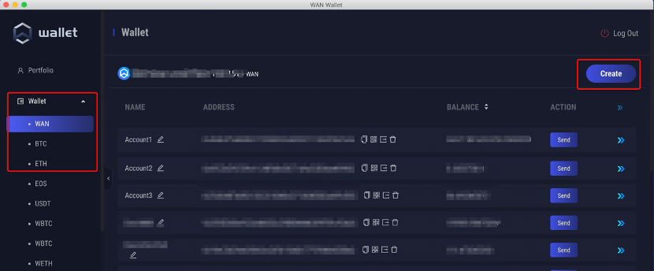

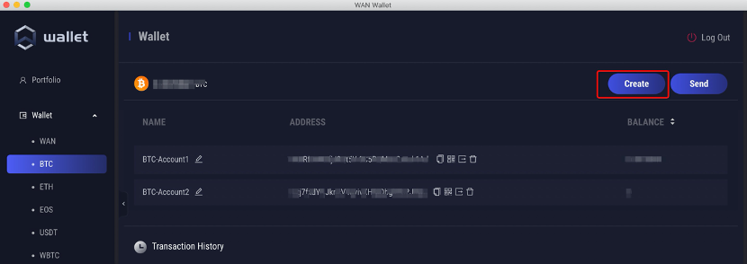

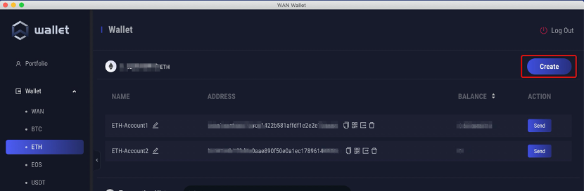
 
**步骤3**：Lucy和Tom各自向自己的WAN地址中转入1个WAN做手续费；

**步骤4**：Lucy将自己的BTC充值到wanchain钱包的BTC地址中（含少量矿工交易费），Tom将自己的ETH充值到wanchain钱包的ETH地址中（含少量gas费）；

**步骤5**：Lucy和Tom各自在钱包的CrossChain跨链页面完成BTC跨链和ETH跨链，将WBTC和WETH跨入存有WAN手续费的地址，得到WBTC和WETH；
 
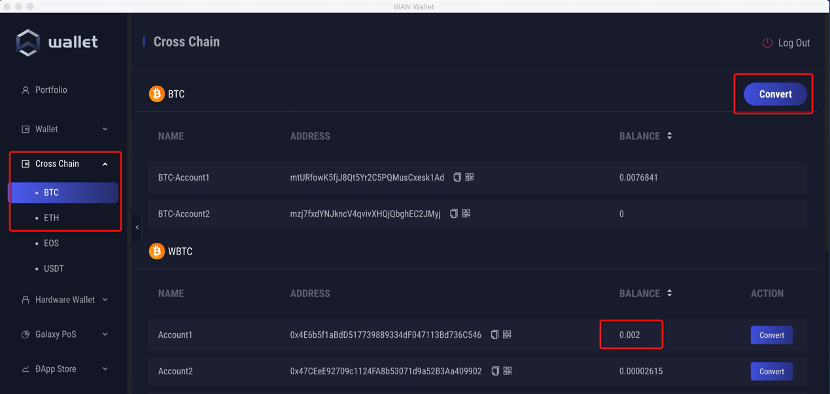

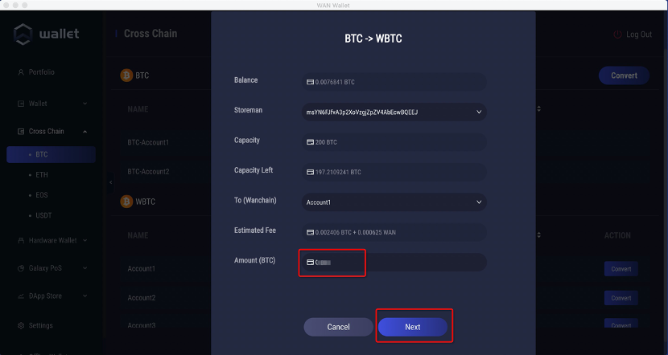

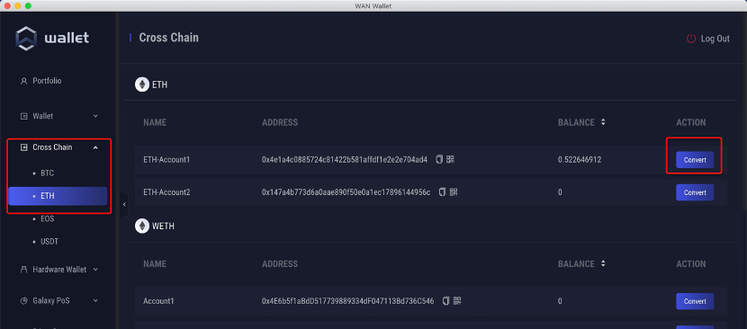

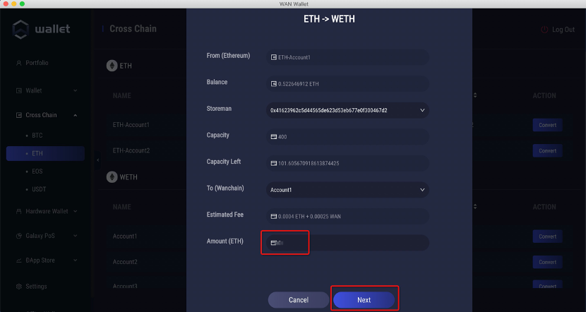
 
**步骤6**：Lucy和Tom打开轻钱包的应用商店，添加P2PE DApp到本地钱包中。

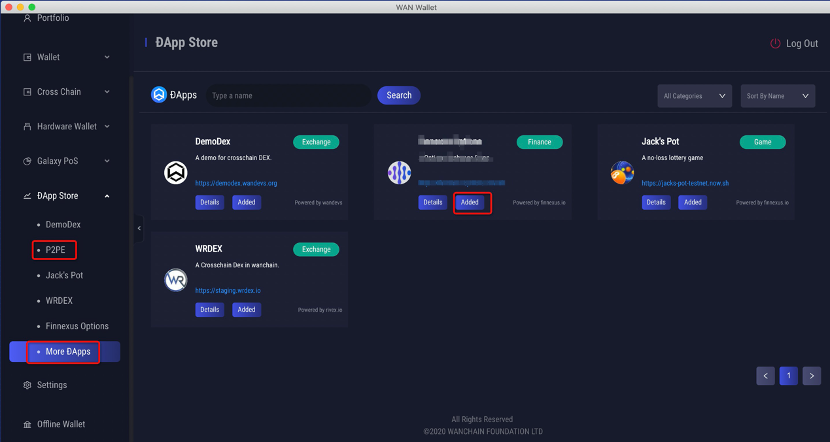

**步骤7**：Lucy和Tom在钱包中打开P2PE页面，并在右上角选中自己跨链后存有WBTC和WETH的地址。

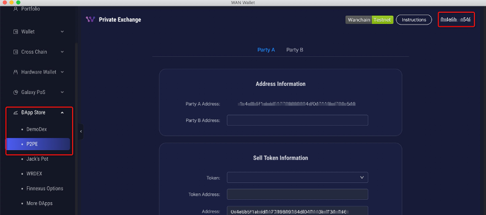

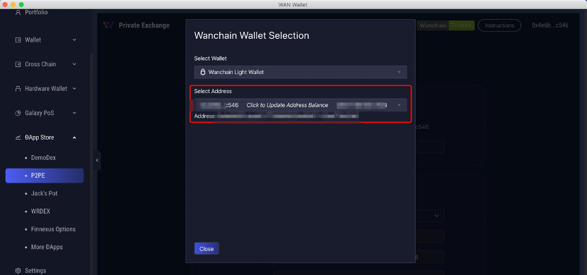
 
**步骤8**：Tom作为PartyB，将自己存有WETH的地址通过社交网络发给Lucy；

**步骤9**：Lucy在PartyA页面将收到的Tom的地址，填写到PartyB的位置，并仔细填写出售和购买信息；仔细核对Token信息，包括Token Smart Contract地址正确性，地址余额正确性等。填写出售24.8个WBTC，购买1,000个WETH。

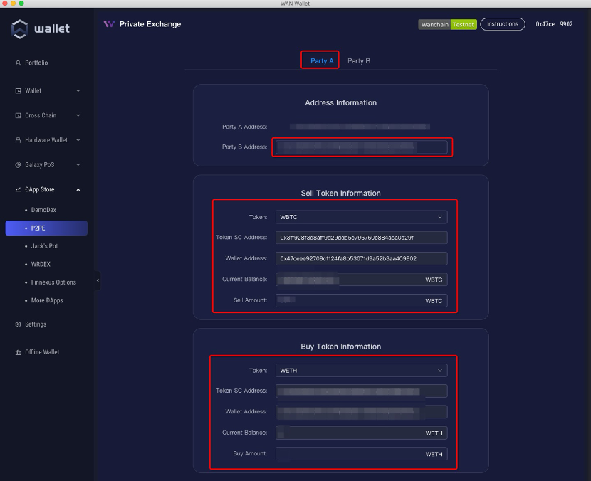
 
**步骤10**：Lucy信息填写核对无误后，选取一个合适的订单超时时间，Tom必须在超时时间范围内完成后续步骤，否则交易订单自动无效；然后Lucy点击下方的Approve授权开关，授予智能合约动用Lucy地址中的24.8个WBTC的权利；

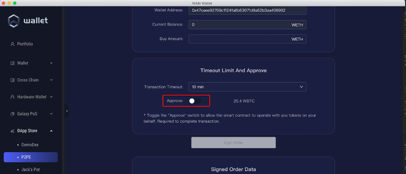

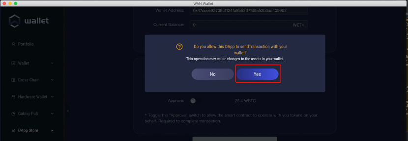

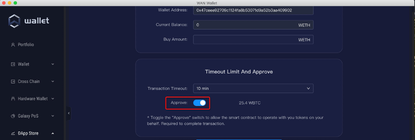

**步骤11**：Lucy完成Approve授权后，点击下方的Sign Order按钮，稍等片刻后，可在下方得到签名后的订单数据，点击Copy Data按钮，将订单数据拷贝，通过社交网络发送给Tom；

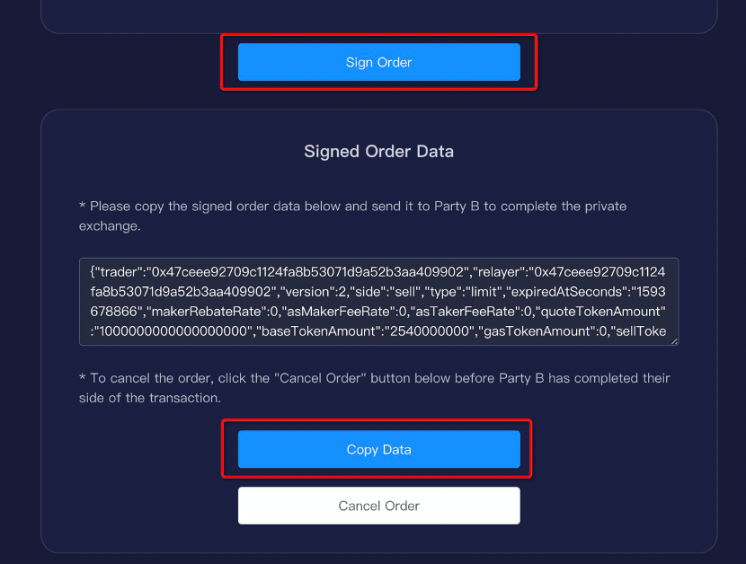

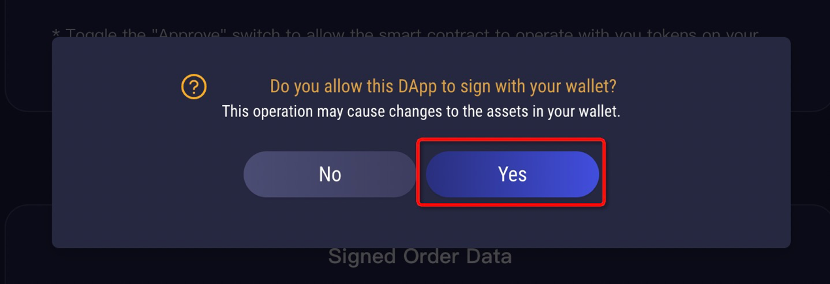
 
**步骤12**：Tom在接收到Lucy的订单数据后，将其粘贴到PartyB页面下的Paste区域，并点击Parse按钮；

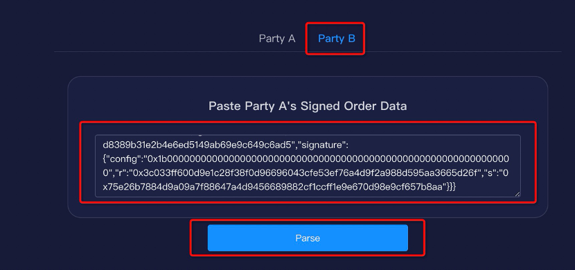

**步骤13**：Tom在下方可看到Parse后的订单详细信息，Tom仔细核对卖出的WETH数量和买入的WBTC数量，仔细核对Token合约地址和账户余额，核对订单过期时间；核对无误后点击Approve按钮，授予智能合约动用账户中1,000个WETH的权利；

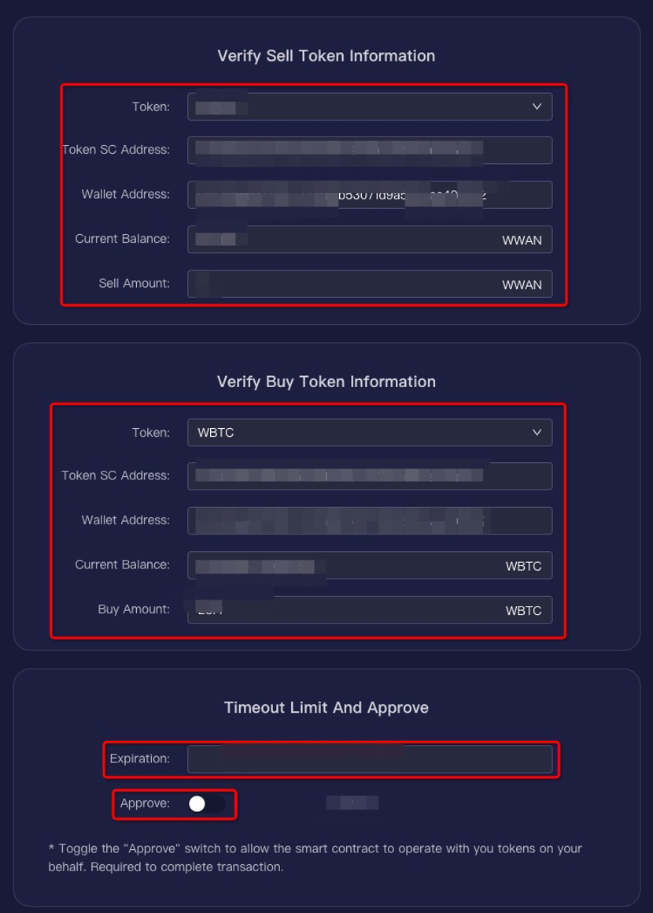

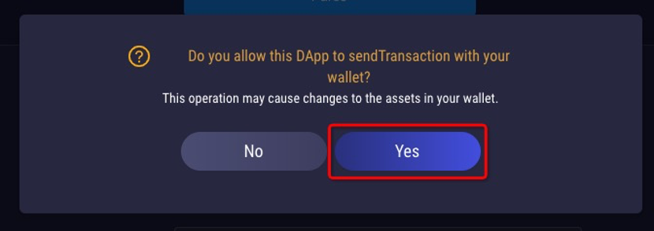
 
**步骤14**：Tom在Approve成功后点击Send to Exchange按钮，将订单发送到智能合约中执行结算。智能合约会验证双方的信息、balance和签名正确性，如果正确，则完成token交换。

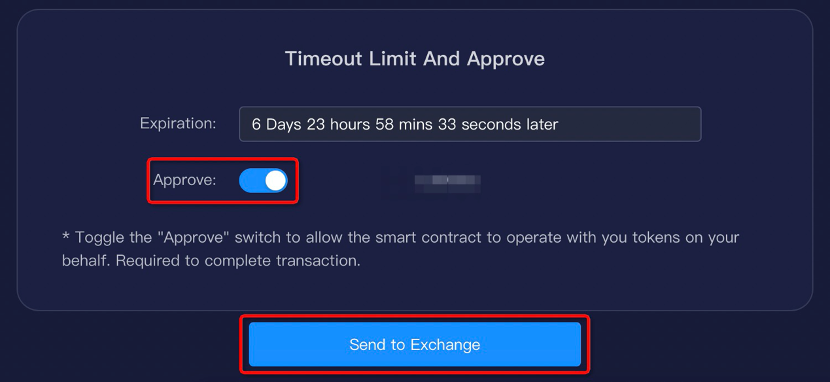

**步骤15**：Lucy和Tom通过上述步骤完成了WBTC和WETH的交换，可以返回钱包跨链页面，按照各自的需求，完成WBTC到BTC、WETH到ETH的跨回操作。至此，整个交易流程全部完成。

# 4. 备注

详细安全分析和工作原理见：URL

智能合约地址：

|  网络   | 合约  | 地址 |
|  ----  | ----  | ---- |
| 主网  | Proxy |0xff6d4cca7509573faa92013496399b82760cf269|
| 主网  | Exchange |0xf0ff1d294e8ce926000ff2cb0a171ca434a5af16|
| 测试网  | Proxy |0x9e57b9f1d836ff1701e441a619cbaad7fc8863d3|
| 测试网  | Exchange |0x8786038ef9c2f659772c6c2ee8402bdfdc511bb8|